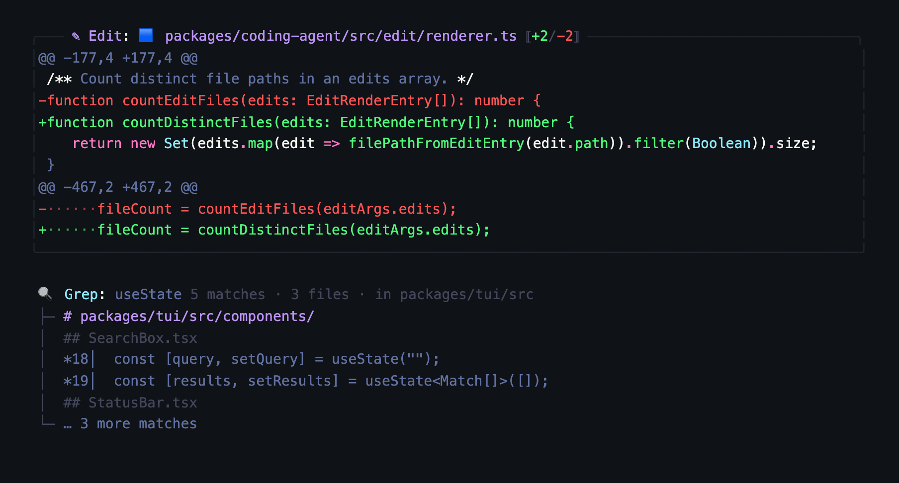

# titanium-dracula

A dark theme for [omp (Oh My Pi)](https://github.com/can1357/oh-my-pi): the brushed-metal
surfaces of the built-in `titanium` theme with a Dracula accent palette.



Purple accents, cyan borders, Dracula-toned diffs and syntax, plus a matching `export`
surface so HTML transcripts keep the same colors.

The status line uses vertical pipe separators, keeps persistent fields text-first, and preserves
icons for conditional modes such as Plan, Prewalk, Vibe, Loop, Pause, and Goal. Fast mode uses a
Dracula-yellow outline lightning bolt; auto thinking and auto-compaction stay icon-free.
Background-job counts stay hidden, and agent counts remain text-only while Vibe keeps its icon.

## Install

Drop the JSON into your themes directory and point `theme.dark` at it:

```bash
mkdir -p ~/.omp/agent/themes
curl -fsSL -o ~/.omp/agent/themes/titanium-dracula.json \
  https://raw.githubusercontent.com/everton-dgn/omp-theme-titanium-dracula/main/titanium-dracula.json
omp config set theme.dark titanium-dracula
```

Or pick it from `/theme` inside omp once the file is in place. The file name is what omp
matches on, so keep it as `titanium-dracula.json`.

A Nerd Font is recommended so the outline Fast-mode lightning bolt renders correctly; conditional
mode indicators still follow the active `symbolPreset`.

## Upstream

The same theme is proposed as a built-in omp theme in
[PR #6651](https://github.com/can1357/oh-my-pi/pull/6651). If it lands, omp ships it and
this repository becomes just a mirror for older versions.

## Palette

Seventeen named colors feed the 66 theme keys. The ones you are most likely to recognize:

| Var | Hex | Used for |
|---|---|---|
| `brushedTitanium` | `#151820` | Editor and chat surface |
| `darkTitanium` | `#0f1216` | Tool cards, status line fill |
| `electricBlue` | `#00b4ff` | Borders and frames |
| `draPurple` | `#BD93F9` | Accent, headings, tool titles |
| `draGreen` | `#50FA7B` | Additions, success, clean git |
| `draRed` | `#FF5555` | Deletions and errors |
| `draOrange` | `#FFB86C` | Warnings and dirty git |
| `draComment` | `#6272A4` | Muted text and separators |

Every value validates against omp's
[theme schema](https://github.com/can1357/oh-my-pi/blob/main/packages/coding-agent/src/modes/theme/theme-schema.json):
66 required colors, no extra keys, no unresolved references.

## Related

[omp-statusline-titanium](https://github.com/everton-dgn/omp-statusline-titanium) — a status
line extension tuned for this theme, adding git divergence and MiniMax Token Plan quota.

## License

MIT
